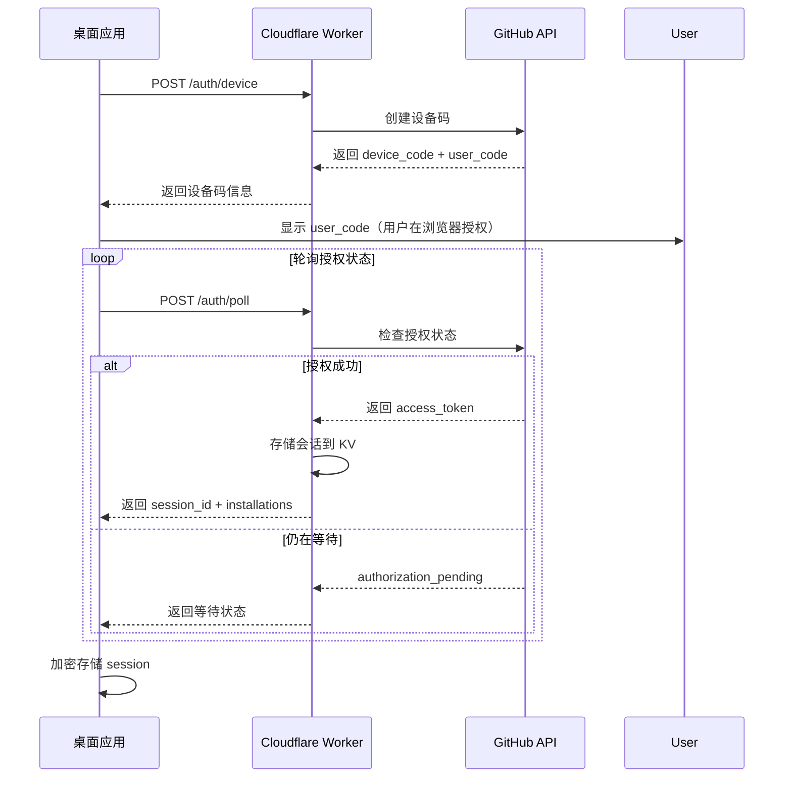

# IssueDesk

一个基于 GitHub Issues 的博客内容管理系统，包含桌面客户端和移动端应用。使用 GitHub App 进行安全认证，支持多组织/账户管理，自动 token 刷新，离线缓存等功能。

## ✨ 特性

- 🔐 **安全认证**: GitHub App 设备流认证，无需个人访问令牌
- 🔄 **自动刷新**: Token 自动更新，无需重新登录
- 🏢 **多账户**: 支持多个 GitHub 组织/账户切换
-  **加密存储**: 使用系统级加密（macOS Keychain、Windows DPAPI）
- 🎨 **现代 UI**: React + Tailwind CSS + Primer Design
- 📝 **Markdown 编辑**: 完整的 Markdown 编辑器，支持图片上传
- 🏷️ **标签管理**: 可视化标签创建、编辑、颜色管理

## 项目结构

这是一个使用 pnpm workspaces 管理的 monorepo：

```
issuedesk/
├── apps/
│   ├── desktop/              # Electron 桌面应用
│   │   ├── src/
│   │   │   ├── main/        # 主进程（Node.js）
│   │   │   │   ├── config/  # 环境配置
│   │   │   │   ├── database/# SQLite 数据库
│   │   │   │   ├── ipc/     # IPC 处理器
│   │   │   │   ├── services/# 后台服务（token监控、连接性）
│   │   │   │   ├── storage/ # 加密存储
│   │   │   │   └── main.ts  # 应用入口
│   │   │   └── renderer/    # 渲染进程（React）
│   │   │       ├── components/
│   │   │       ├── hooks/
│   │   │       ├── pages/
│   │   │       └── App.tsx
│   │   ├── assets/
│   │   │   └── icons/       # 应用图标（.icns, .ico, .png）
│   │   ├── forge.config.ts  # Electron Forge 配置
│   │   └── package.json
│   └── mobile/              # React Native 移动应用（待实现）
├── packages/
│   ├── shared/              # 共享类型和工具
│   │   ├── src/
│   │   │   ├── types/       # TypeScript 类型定义
│   │   │   ├── schemas/     # Zod 验证模式
│   │   │   ├── constants/   # 常量
│   │   │   └── utils/       # 工具函数
│   │   └── package.json
│   └── github-api/          # GitHub REST API 客户端
│       ├── src/
│       │   ├── github-client.ts
│       │   ├── rate-limit.ts
│       │   └── index.ts
│       └── package.json
├── workers/
│   └── auth/                # Cloudflare Worker 认证后端
│       ├── src/
│       │   ├── handlers/    # 路由处理器
│       │   ├── storage/     # KV 存储
│       │   ├── auth/        # 认证逻辑
│       │   └── index.ts
│       ├── wrangler.toml    # Cloudflare 配置
│       └── package.json
├── specs/                   # 功能规格文档
│   ├── 001-issues-management/
│   ├── 002-github-app-auth/
│   └── 003-worker-deploy-docs/
├── configure-backend.sh     # 后端 URL 配置脚本
├── package.json             # 根 package.json（workspaces）
└── pnpm-workspace.yaml      # pnpm workspace 配置
```

## 📋 环境要求

- **Node.js** >= 18.0.0
- **pnpm** >= 8.0.0
- **操作系统**: macOS, Windows 10+, Linux
- **GitHub 账户**: 需要安装 GitHub App

## 🚀 快速开始

### 1. 安装依赖

```bash
# 安装 pnpm (如果还未安装)
npm install -g pnpm

# 克隆项目
git clone https://github.com/Noteverso/issuedesk.git
cd issuedesk

# 安装所有包的依赖
pnpm install
```

### 2. 构建共享包

桌面应用依赖共享包，需要按顺序构建：

```bash
# 1. 构建 shared 包（基础类型和工具）
pnpm build:shared

# 2. 安装 github-api 包的依赖（链接已构建的 shared 包）
pnpm install

# 3. 构建 github-api 包
pnpm build:github-api

# 4. 安装 desktop 应用的依赖（链接已构建的包）
pnpm install

# 或者使用快捷命令一次性完成
pnpm build:packages && pnpm install
```

> **注意**: 依赖顺序为 `shared` → `github-api` → `desktop`。每次构建共享包后需要运行 `pnpm install` 以更新依赖链接。

### 3. 配置认证后端

IssueDesk 使用 Cloudflare Worker 作为认证后端。

#### 本地开发（使用本地 Worker）

```bash
# 1. 配置环境变量
cd workers/auth
cp .dev.vars.example .dev.vars
# 编辑 .dev.vars，填入你的 GitHub App 凭证

# 2. 启动本地 Worker（在一个终端）
pnpm dev:auth

# 3. 启动桌面应用（在另一个终端）
pnpm dev:desktop
```

#### 生产环境（部署到 Cloudflare）

查看完整部署指南：[workers/auth/docs/DEPLOYMENT.md](workers/auth/docs/DEPLOYMENT.md)

```bash
# 1. 登录 Cloudflare
cd workers/auth
npx wrangler login

# 2. 创建 KV 命名空间
npx wrangler kv:namespace create "SESSIONS"

# 3. 配置 secrets
npx wrangler secret put GITHUB_APP_ID
npx wrangler secret put GITHUB_CLIENT_ID
npx wrangler secret put GITHUB_CLIENT_SECRET
npx wrangler secret put GITHUB_PRIVATE_KEY

# 4. 部署
npx wrangler deploy
```

### 4. 创建 GitHub App

1. 访问 https://github.com/settings/apps/new
2. 填写基本信息：
   - **App name**: IssueDesk (或自定义)
   - **Homepage URL**: 你的项目主页
   - **Callback URL**: 留空（使用设备流）
   - **Webhook**: 禁用
3. 设置权限：
   - **Repository permissions**:
     - Issues: Read and write
     - Metadata: Read-only
     - Contents: Read and write
4. 点击 **Create GitHub App**
5. 记录以下信息：
   - App ID
   - Client ID
   - Client Secret（生成后立即复制）
   - Private Key（下载 .pem 文件）

详细指南：[workers/auth/docs/ENV_SETUP.md](workers/auth/docs/ENV_SETUP.md)

### 5. 启动桌面应用

```bash
# 开发模式
pnpm dev:desktop

# 首次启动会提示登录 GitHub
# 按照界面提示完成设备流认证
```

## 💻 开发指南

### 桌面应用开发

```bash
# 开发模式（热重载）
pnpm dev:desktop

# 生产模式测试（使用生产后端）
NODE_ENV=production pnpm dev:desktop

# 类型检查
pnpm --filter @issuedesk/desktop type-check

# 代码检查
pnpm --filter @issuedesk/desktop lint
```

### 认证后端开发

```bash
# 本地开发
pnpm dev:auth

# 测试端点
curl http://localhost:8787/health

# 验证环境变量
pnpm --filter @issuedesk/auth-worker validate-env

# 部署到开发环境
pnpm --filter @issuedesk/auth-worker deploy:dev

# 部署到生产环境
pnpm --filter @issuedesk/auth-worker deploy:prod
```

### 共享包开发

```bash
# 构建 shared 包
pnpm build:shared

# 构建 github-api 包
pnpm build:github-api

# 构建所有共享包
pnpm build:packages

# 监听模式（开发时使用）
pnpm --filter @issuedesk/shared dev
```

## 📦 构建和打包

### 构建桌面应用

```bash
# 构建（不打包）
pnpm build:desktop

# 打包为 DMG（macOS）
pnpm dist:desktop:make

# 输出：apps/desktop/out/make/
```

### 配置生产环境后端 URL

在打包前，需要配置生产环境的后端 URL：

#### 方法 1: 编辑配置文件（推荐）

```bash
# 编辑 apps/desktop/src/main/config/environment.ts
# 将第 24 行的 URL 改为你的 Cloudflare Worker URL
```

#### 方法 2: 使用配置脚本

```bash
./configure-backend.sh https://yourname.workers.dev
```

#### 方法 3: 环境变量

```bash
AUTH_WORKER_URL="https://your-worker-url.workers.dev" pnpm dist:desktop:make
```

详细说明：[docs/BUILD-DMG.md](docs/BUILD-DMG.md)

### macOS 代码签名

打包后的应用需要签名才能访问 Keychain（用于加密存储）：

```bash
# 进入构建目录
cd apps/desktop/out/IssueDesk-darwin-arm64

# Ad-hoc 签名（测试用）
codesign --force --deep --sign - IssueDesk.app

# 使用 Developer ID 签名（分发用）
codesign --force --deep --sign "Developer ID Application: Your Name (TEAMID)" \
  --options runtime \
  IssueDesk.app

# 验证签名
codesign --verify --deep --strict --verbose=2 IssueDesk.app
```

### 跨平台打包

```bash
# macOS (ARM64)
pnpm dist:desktop:mac:arm64

# macOS (x64)
pnpm --filter @issuedesk/desktop make --platform=darwin --arch=x64

# macOS (Universal)
pnpm dist:desktop:mac:universal

# Windows
pnpm dist:desktop:win

# Linux
pnpm dist:desktop:linux
```

## 🧪 测试

### 单元测试

```bash
# 运行所有测试
pnpm test

# 测试特定包
pnpm --filter @issuedesk/shared test
pnpm --filter @issuedesk/github-api test
pnpm --filter @issuedesk/auth-worker test

# 监听模式
pnpm --filter @issuedesk/desktop test:watch
```

### 集成测试

```bash
# 测试认证流程
cd apps/desktop
pnpm dev:desktop
# 在应用中执行：登录 → 选择仓库 → 创建 Issue

# 测试后端健康检查
curl http://localhost:8787/health
# 预期输出: {"status":"ok","worker":"issuedesk-auth"}

# 测试设备流
curl -X POST http://localhost:8787/auth/device \
  -H "Content-Type: application/json"
```

### 端到端测试场景

1. **认证流程测试**
   - 启动应用 → 点击登录 → 浏览器授权 → 回到应用查看登录状态
   
2. **Token 刷新测试**
   - 等待 token 过期（或手动修改 `expires_at`）
   - 应用应自动刷新 token，无需重新登录

3. **多账户切换测试**
   - 安装 GitHub App 到多个组织/仓库
   - 在应用中切换不同的 installation
   - 验证数据正确加载

## 📱 功能特性

### 已实现功能

#### 1. GitHub App 认证
- ✅ 设备流认证（无需 OAuth 回调）
- ✅ 自动 token 刷新（5分钟内过期时自动刷新）
- ✅ 多组织/账户支持
- ✅ 会话持久化（30天滑动窗口）
- ✅ 安全存储（macOS Keychain / Windows DPAPI）

#### 2. Issues 管理
- ✅ 创建、编辑、删除 Issues
- ✅ Markdown 编辑器（Tiptap）
- ✅ 图片上传（支持本地/Cloudflare R2）
- ✅ 状态管理（开放/关闭）
- ✅ 评论功能

#### 3. Labels 管理
- ✅ 创建、编辑、删除标签
- ✅ 颜色选择器
- ✅ 标签描述
- ✅ 批量操作

#### 4. 系统功能
- ✅ 主题切换（亮色/暗色）
- ✅ 仓库配置
- ✅ 数据库管理（重置、导出）
- ✅ 错误处理和重试机制
- ✅ 加载状态和进度指示

### 待实现功能

- ⏳ 离线缓存（SQLite 本地数据库）
- ⏳ 图片上传到 Cloudflare R2
- ⏳ 移动端应用（React Native）
- ⏳ 高级搜索和过滤
- ⏳ Milestone 管理
- ⏳ Project boards 集成
- ⏳ 快捷键支持
- ⏳ 批量编辑 Issues
- ⏳ 导出为 Markdown/PDF

## 🔧 配置说明

### 桌面应用配置

配置文件位于：`apps/desktop/src/main/config/environment.ts`

```typescript
// 开发环境：使用本地 Worker
const isDev = process.env.NODE_ENV === 'development';
// 后端 URL：开发用 localhost:8787，生产用 Cloudflare Worker URL
const BACKEND_URL = isDev ? 'http://localhost:8787' : 'https://your-worker.workers.dev';
```

### 认证后端配置

配置文件位于：`workers/auth/wrangler.toml`

```toml
name = "issuedesk-auth"
main = "src/index.ts"
compatibility_date = "2024-11-01"

# KV 命名空间（存储会话）
[[kv_namespaces]]
binding = "SESSIONS"
id = "your-kv-namespace-id"

# Secrets（通过 wrangler secret put 设置）
# GITHUB_APP_ID
# GITHUB_PRIVATE_KEY
# GITHUB_CLIENT_ID
# GITHUB_CLIENT_SECRET
```

## 🔐 安全性

### 认证安全

- ✅ 使用 GitHub App（更安全，避免个人访问令牌泄露）
- ✅ 短期有效 token（1小时过期）
- ✅ 自动刷新机制（5分钟内过期时自动刷新）
- ✅ 后端仅存储会话 ID，不存储敏感凭证
- ✅ HTTPS 传输（生产环境）

### 数据存储安全

- ✅ 使用系统级加密：
  - macOS: Keychain
  - Windows: DPAPI (Data Protection API)
  - Linux: Secret Service API
- ✅ Token 加密存储在本地
- ✅ 不在代码中硬编码任何凭证

### 代码签名

- ✅ macOS 应用需要签名才能访问 Keychain
- ✅ 支持 Ad-hoc 签名（开发测试）
- ✅ 支持 Developer ID 签名（公开分发）
- ⏳ 计划支持 Notarization（Apple 公证）

## 📚 文档索引

### 功能规格
- [Issues 管理规格](specs/001-issues-management/spec.md)
- [GitHub App 认证规格](specs/002-github-app-auth/spec.md)
- [快速开始指南](specs/002-github-app-auth/quickstart.md)

### 部署文档
- [Cloudflare Worker 部署指南](workers/auth/docs/DEPLOYMENT.md)
- [环境变量设置](workers/auth/docs/ENV_SETUP.md)
- [Secrets 配置](workers/auth/SECRETS-SETUP.md)
- [私钥转换指南](workers/auth/PRIVATE-KEY-CONVERSION.md)

### 开发文档
- [DMG 构建指南](docs/BUILD-DMG.md)
- [图标设置指南](docs/ICON-SETUP.md)
- [后端 URL 配置](docs/BACKEND-URL-FIX.md)

### 迁移指南
- [从 PAT 迁移到 GitHub App](specs/002-github-app-auth/MIGRATION-FROM-PAT.md)

## 🛠️ 技术栈

### 桌面应用
- **框架**: Electron 33+
- **UI**: React 18+ + TypeScript 5.3+
- **样式**: Tailwind CSS + Primer CSS
- **编辑器**: Tiptap (Markdown)
- **状态管理**: React Hooks
- **路由**: React Router v7
- **数据库**: better-sqlite3
- **图标**: Lucide React

### 认证后端
- **运行时**: Cloudflare Workers
- **语言**: TypeScript 5.3+ (ES2020+)
- **存储**: Cloudflare KV
- **认证**: @octokit/auth-app
- **验证**: Zod

### 共享包
- **类型系统**: TypeScript 5.3+
- **验证**: Zod 3.23+
- **API 客户端**: Axios
- **工具**: date-fns, lodash

### 开发工具
- **包管理**: pnpm 9+
- **构建工具**: Vite 6+, Electron Forge
- **代码检查**: ESLint
- **类型检查**: TypeScript
- **测试**: Vitest

## 🏗️ 架构设计

### 认证流程



### 数据流

```
┌─────────────────┐
│  React UI       │
│  (Renderer)     │
└────────┬────────┘
         │ IPC
         │
┌────────▼────────┐      ┌──────────────┐
│  Main Process   │◄────►│  SQLite DB   │
│  (Electron)     │      │  (Local)     │
└────────┬────────┘      └──────────────┘
         │ HTTPS
         │
┌────────▼────────┐      ┌──────────────┐
│  Auth Worker    │◄────►│  KV Storage  │
│  (Cloudflare)   │      │  (Sessions)  │
└────────┬────────┘      └──────────────┘
         │ REST API
         │
┌────────▼────────┐
│  GitHub API     │
└─────────────────┘
```

## 🤝 贡献指南

### 添加新功能

1. **规划**: 在 `specs/` 下创建功能规格文档
2. **类型**: 在 `packages/shared/src/types/` 定义类型
3. **API**: 在 `packages/github-api/` 实现 API 调用
4. **IPC**: 在 `apps/desktop/src/main/ipc/` 添加 IPC 处理器
5. **UI**: 在 `apps/desktop/src/renderer/` 实现界面
6. **测试**: 编写单元测试和集成测试
7. **文档**: 更新相关文档

### 代码规范

```bash
# 格式化代码（如果配置了 Prettier）
pnpm format

# 运行 lint
pnpm lint

# 类型检查
pnpm type-check

# 修复 lint 错误
pnpm --filter @issuedesk/desktop lint --fix
```

### 提交规范

使用 Conventional Commits 格式：

```
feat: 添加图片上传功能
fix: 修复 token 刷新问题
docs: 更新部署文档
chore: 升级依赖
refactor: 重构认证逻辑
test: 添加认证流程测试
```

## 🐛 故障排查

### 常见问题

#### 1. Keychain 错误（macOS）

```
Error: errSecAuthFailed / Authorization/Authentication failed
```

**解决方案**: 对应用进行代码签名
```bash
codesign --force --deep --sign - IssueDesk.app
```

#### 2. 后端 URL 错误

```
Error: Failed to fetch
```

**解决方案**: 检查 `apps/desktop/src/main/config/environment.ts` 中的后端 URL

#### 3. 环境变量未找到

```
Error: Missing environment variables
```

**解决方案**: 
- 开发环境：检查 `workers/auth/.dev.vars`
- 生产环境：使用 `wrangler secret list` 检查 secrets

#### 4. Token 过期

```
Error: Bad credentials
```

**解决方案**: 应用会自动刷新 token。如果仍然失败，尝试重新登录。

### 清理和重置

```bash
# 清理所有 node_modules
pnpm clean

# 重新安装依赖
pnpm install

# 清理构建产物
rm -rf apps/desktop/out
rm -rf apps/desktop/.vite

# 重置数据库（macOS）
rm -rf ~/Library/Application\ Support/issuedesk/databases

# 重置会话存储（macOS）
rm -rf ~/Library/Application\ Support/issuedesk/auth.json
```

## 📝 开发路线图

### v1.0 (已完成)
- ✅ GitHub App 认证
- ✅ Issues CRUD 操作
- ✅ Labels 管理
- ✅ Token 自动刷新

### v1.1 (进行中)
- 🔄 离线缓存（SQLite 本地数据库）
- 🔄 图片上传到 Cloudflare R2
- 🔄 高级搜索和过滤
- 🔄 快捷键支持

### v2.0 (计划中)
- ⏳ 移动端应用
- ⏳ Milestone 管理
- ⏳ Project boards
- ⏳ 协作功能（多用户）

## 📄 许可证

MIT License

## 🙏 致谢

- [Electron](https://www.electronjs.org/)
- [Cloudflare Workers](https://workers.cloudflare.com/)
- [GitHub API](https://docs.github.com/en/rest)
- [Primer Design System](https://primer.style/)
- [Tiptap Editor](https://tiptap.dev/)

## 📞 联系方式

- **问题反馈**: [GitHub Issues](https://github.com/yourusername/issuedesk/issues)
- **功能请求**: [GitHub Discussions](https://github.com/yourusername/issuedesk/discussions)

---

Made with ❤️ by [Your Name]
2. **后端安全**: 所有敏感凭据（私钥、密钥）仅存储在 Cloudflare Worker
3. **Token管理**: 1小时access tokens，30天会话持久化
4. **自动刷新**: Token在过期前5分钟自动刷新
5. **离线支持**: 后端不可达时使用缓存token的只读模式

详见 [specs/002-github-app-auth/](specs/002-github-app-auth/) 了解完整的设计和实现细节。

## 许可证

MIT License
